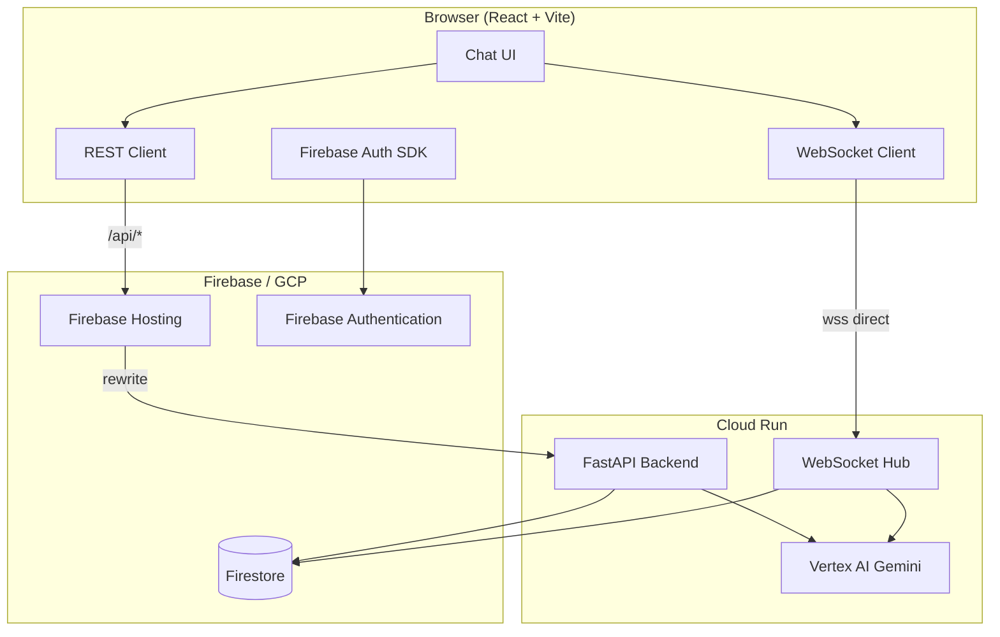

# TeamChat AI

Multi-tenant collaborative chat where teams share rooms, message in real time, and invoke **Gemini** with `@Gemini` or `@AI` mentions. Built with React, FastAPI, Firebase, and Google Cloud.

## Live demo

| | |
|---|---|
| **App** | [https://multichat-f37f7.web.app](https://multichat-f37f7.web.app) |
| **Login** | [https://multichat-f37f7.web.app/login](https://multichat-f37f7.web.app/login) |

### Test credentials

Default password for all accounts: **`TeamChatDev123!`**

| Organization | Email | Role |
|--------------|-------|------|
| Acme Inc | `sarah@acme.test` | admin |
| Acme Inc | `mike@acme.test` | member |
| Globex Corp | `john@globex.test` | admin |

**Try it:** sign in as Sarah, open the **general** room, and send `@Gemini Hello`.

> Demo accounts are for evaluation only. Do not store sensitive data.

---

## Features

- **Multi-tenant isolation** — users only see data for their organization
- **Real-time chat** — messages, typing indicators, and online presence over WebSockets
- **AI mentions** — stream Gemini responses inline with `@Gemini` / `@AI`
- **Admin tools** — create rooms and manage members (admin role)
- **Durable storage** — Firestore for organizations, users, rooms, and messages

---

## Architecture



### Design principles

| Concern | Approach |
|---------|----------|
| **Persistence** | Firestore is the source of truth |
| **Realtime** | Backend WebSockets — no client-side Firestore listeners |
| **Bootstrap** | REST APIs load rooms, messages, and user profile |
| **Tenancy** | `organizationId` is derived server-side from the auth token |
| **Production routing** | Firebase Hosting rewrites `/api/**` to Cloud Run; WebSockets connect **directly** to Cloud Run (`VITE_WS_URL`) because Hosting does not proxy WebSocket upgrades reliably |

More detail: [docs/architecture.md](docs/architecture.md) · [docs/data-model.md](docs/data-model.md) · [docs/events.md](docs/events.md)

---

## Repository layout

```
├── backend/      FastAPI + Python (REST, WebSockets, Gemini)
├── frontend/     React + TypeScript + Vite + Tailwind
├── firebase/     Firestore security rules
├── scripts/      Dev seed script (Acme + Globex demo data)
├── docs/         Architecture, deployment, and domain docs
└── firebase.json Firebase Hosting config + API rewrites
```

---

## Local development

### Prerequisites

- **Node.js** 18+
- **Python** 3.11+ (3.13 recommended)
- A **Firebase/GCP project** with Firestore, Auth (Email/Password), and (optionally) Vertex AI enabled
- **gcloud** / **firebase** CLI for deployment and seeding

### 1. Clone and configure

```bash
git clone https://github.com/AnishChandran/teamchat-ai.git
cd teamchat-ai
```

### 2. Backend

```bash
cd backend
python -m venv .venv
source .venv/bin/activate          # Windows: .venv\Scripts\activate
pip install -r requirements.txt
cp .env.example .env               # set FIREBASE_PROJECT_ID, etc.
uvicorn app.main:app --reload --port 8000
```

Health check: `curl http://localhost:8000/health`

### 3. Frontend

```bash
cd frontend
npm install
cp .env.example .env               # Firebase web app config from Console
npm run dev
```

Open [http://localhost:5173](http://localhost:5173). Vite proxies `/api` and `/ws` to the backend on port 8000.

### 4. Seed demo data

Requires a service account with Firebase Auth Admin + Firestore access:

```bash
cd backend
source .venv/bin/activate

export GOOGLE_APPLICATION_CREDENTIALS=/path/to/service-account.json
export FIREBASE_PROJECT_ID=your-firebase-project-id

python ../scripts/seed_dev_data.py
```

Full credential list and troubleshooting: [docs/seed-credentials.md](docs/seed-credentials.md)

### 5. Run tests

```bash
cd backend
pytest
```

---

## Deployment

Production stack: **Cloud Run** (backend) + **Firebase Hosting** (frontend) + **Firestore** + **Vertex AI** (Gemini).

### Overview

```text
1. Enable GCP APIs + create runtime service account
2. Seed Firestore + Firebase Auth (seed script)
3. Build & deploy backend → Cloud Run
4. Deploy Firestore rules
5. Build frontend with production env vars
6. Deploy frontend → Firebase Hosting
```

### Backend → Cloud Run

```bash
cd backend

export PROJECT_ID=your-gcp-project-id
export REGION=us-central1
export SA=teamchat-ai-backend@${PROJECT_ID}.iam.gserviceaccount.com

# Build & push
gcloud builds submit --tag "gcr.io/${PROJECT_ID}/teamchat-ai-backend"

# Deploy
gcloud run deploy teamchat-ai-backend \
  --image "gcr.io/${PROJECT_ID}/teamchat-ai-backend" \
  --region "${REGION}" \
  --service-account "${SA}" \
  --set-env-vars "FIREBASE_PROJECT_ID=${PROJECT_ID},GEMINI_MODEL=gemini-2.5-flash,DEBUG=false,VERTEX_AI_LOCATION=${REGION}" \
  --allow-unauthenticated \
  --port 8080 \
  --timeout 3600
```

Runtime service account needs: `roles/datastore.user`, `roles/firebaseauth.admin`, `roles/aiplatform.user`.

Full guide: [docs/cloud-run-deployment.md](docs/cloud-run-deployment.md)

### Frontend → Firebase Hosting

```bash
cd frontend
cp .env.production.example .env.production
# Set VITE_FIREBASE_* and VITE_WS_URL=wss://YOUR-CLOUD-RUN-URL (no /ws suffix)
npm run build:prod

cd ..
cp .firebaserc.example .firebaserc   # set your Firebase project ID
firebase deploy --only hosting,firestore:rules
```

**Important:** leave `VITE_API_URL` empty so `/api` uses Hosting rewrites. Set `VITE_WS_URL` to your Cloud Run **wss://** URL — WebSockets cannot go through Firebase Hosting.

Full guide: [docs/firebase-hosting-deployment.md](docs/firebase-hosting-deployment.md)

### Environment variables (production)

| Component | Key variables |
|-----------|----------------|
| **Cloud Run** | `FIREBASE_PROJECT_ID`, `GEMINI_MODEL` (`gemini-2.5-flash`), `VERTEX_AI_LOCATION` |
| **Frontend build** | `VITE_FIREBASE_*`, `VITE_WS_URL`, empty `VITE_API_URL` |

Never commit `.env.production`, service account JSON, or `.firebaserc` with secrets.

---

## Tech stack

| Layer | Technology |
|-------|------------|
| Frontend | React 18, TypeScript, Vite, Tailwind CSS, Zustand |
| Backend | FastAPI, Python 3.13, uvicorn |
| Auth | Firebase Authentication (email/password) |
| Database | Cloud Firestore |
| Realtime | WebSockets (FastAPI) |
| AI | Vertex AI Gemini (`google-genai`) |
| Hosting | Firebase Hosting + Cloud Run |

---

## Documentation

| Doc | Description |
|-----|-------------|
| [architecture.md](docs/architecture.md) | System design and data flow |
| [data-model.md](docs/data-model.md) | Firestore collections and fields |
| [events.md](docs/events.md) | WebSocket event protocol |
| [seed-credentials.md](docs/seed-credentials.md) | Demo users and seed script |
| [cloud-run-deployment.md](docs/cloud-run-deployment.md) | Backend deployment |
| [firebase-hosting-deployment.md](docs/firebase-hosting-deployment.md) | Frontend deployment |
| [firestore-security.md](docs/firestore-security.md) | Security rules |

---

## License

MIT (or specify your license here)
